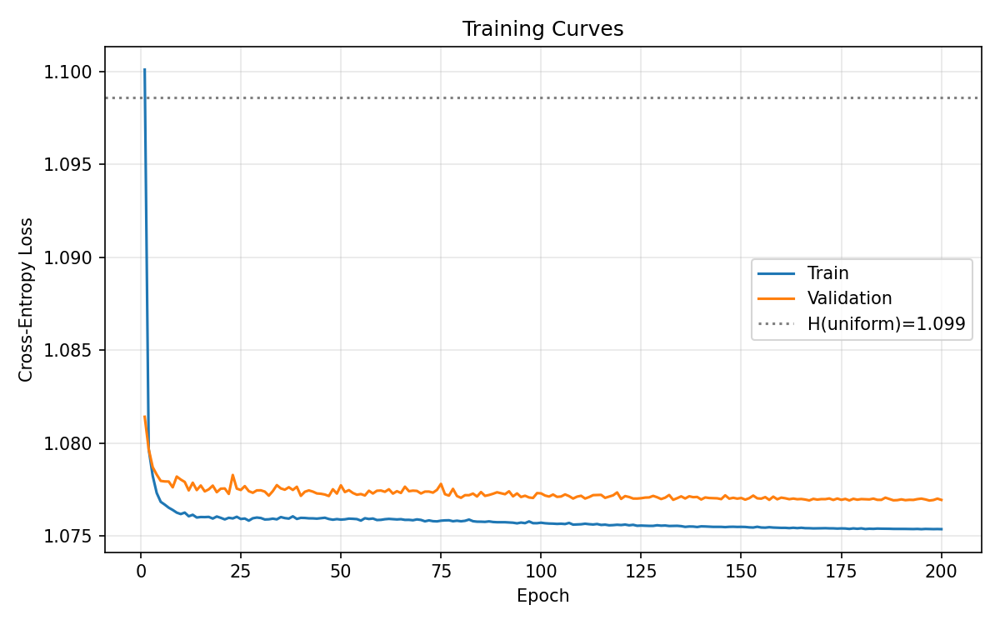
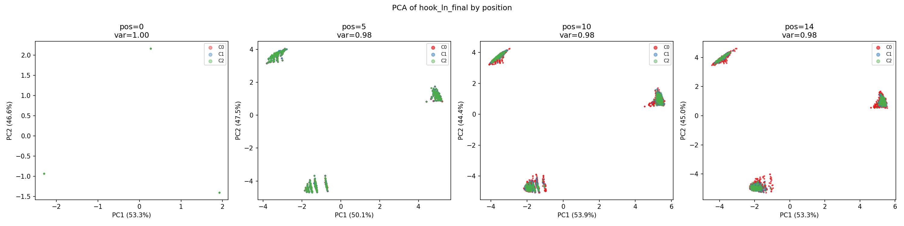
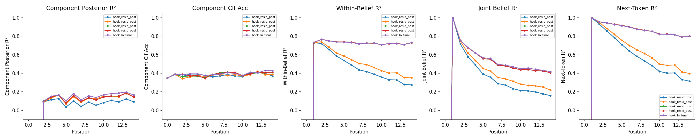
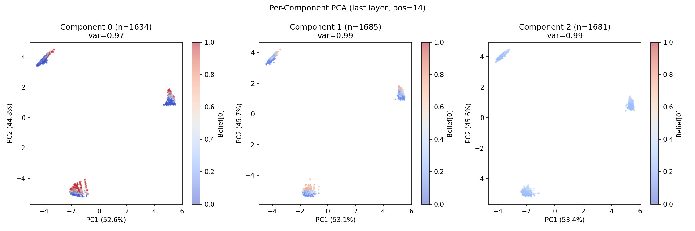
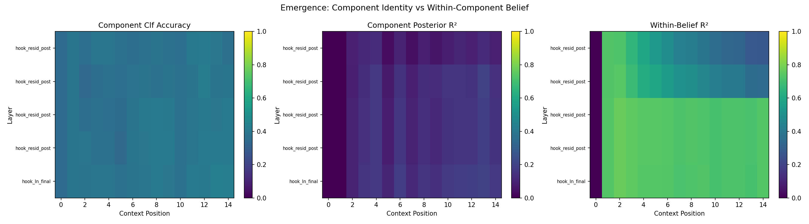
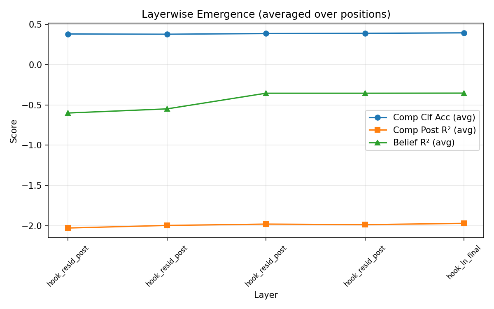

# Residual Stream Geometry in a Non-Ergodic Mess3 Mixture: Belief-State Representations Under Latent Component Uncertainty

## 1. Executive Summary

We train a small attention-only transformer on next-token prediction over a non-ergodic dataset constructed as a mixture of three distinct Mess3 ergodic processes. Each training sequence is generated entirely by one component, requiring the model to implicitly handle both within-component belief tracking and between-component uncertainty.

**Key findings:**

1. The model achieves near-Bayes-optimal loss (1.077 vs. 1.076 nats), capturing 94% of the available predictive information.
2. The dominant geometric structure in residual-stream activations is organized by **current token identity** (3 well-separated clusters), not by component identity.
3. Component identity is only weakly discriminated (classification accuracy ~43% vs. 33% chance), reflecting the genuine difficulty of telling these Mess3 variants apart from 16 tokens.
4. Within-component belief states are linearly decodable from activations (R² ≈ 0.73 at later layers), confirming the model tracks latent hidden-state distributions.
5. The representation is best described as a **token-anchored belief geometry**: 3 token clusters, each with internal belief-simplex structure, with minimal component separation—consistent with Alternative B/C from our pre-registration rather than the predicted hierarchical geometry.

---

## 2. Problem Setup

### The Mess3 Process

Mess3 is a 3-state, 3-observation Hidden Markov Model parameterized by $(x, a)$ where $x \in (0, 0.5)$ controls inter-state mixing and $a \in (0, 1)$ controls self-transition strength. With $b = (1-a)/2$ and $y = 1-2x$, the transition operators $T^{(v)}$ for observation $v \in \{0, 1, 2\}$ are:

$$T^{(0)} = \begin{pmatrix} ay & bx & bx \\ ax & by & bx \\ ax & bx & by \end{pmatrix}, \quad
T^{(1)} = \begin{pmatrix} by & ax & bx \\ bx & ay & bx \\ bx & ax & by \end{pmatrix}, \quad
T^{(2)} = \begin{pmatrix} by & bx & ax \\ bx & by & ax \\ bx & bx & ay \end{pmatrix}$$

where $T^{(v)}_{s,s'} = P(\text{emit } v, \text{go to } s' \mid \text{in state } s)$.

The state transition matrix $S = \sum_v T^{(v)}$ has the symmetric form:

$$S = \begin{pmatrix} 1-2x & x & x \\ x & 1-2x & x \\ x & x & 1-2x \end{pmatrix}$$

This depends only on $x$, not on $a$. All entries are positive when $0 < x < 0.5$, ensuring ergodicity. The stationary distribution is uniform: $\pi = (1/3, 1/3, 1/3)$.

Within a single Mess3 process, belief states (posterior over hidden states given observed token history) live in the 2-simplex $\Delta^2$.

### The Non-Ergodic Mixture

We construct K=3 components:

| Component | $x$ | $a$ | Label | Spectral Gap | Description |
|-----------|-----|-----|-------|-------------|-------------|
| C0 | 0.08 | 0.75 | slow  | 0.24 | Sticky, slow mixing |
| C1 | 0.15 | 0.55 | mid   | 0.45 | Moderate dynamics |
| C2 | 0.25 | 0.40 | fast  | 0.75 | Fast mixing, diffuse |

**Ergodicity verification:** Each component has all transition probabilities strictly positive (verified numerically: $\min T^{(v)}_{s,s'} > 0$ for all $v, s, s'$). Since all entries of the state transition matrix $S$ are positive, each component's Markov chain is irreducible and aperiodic, hence ergodic. The spectral gaps range from 0.24 (slow mixing for C0) to 0.75 (fast mixing for C2).

**Non-ergodicity at the sequence level:** Each training sequence is generated entirely by one component $c \sim \text{Cat}(1/3, 1/3, 1/3)$. The component identity is fixed for the full sequence. From the learner's perspective, the data-generating process is non-ergodic: the long-run statistics of a sequence depend on which component generated it, and no single ergodic process can describe the full dataset.

---

## 3. Dataset Construction

- **Training set:** 50,000 sequences of length 16, balanced across components (~33.3% each)
- **Validation set:** 5,000 sequences
- **Vocabulary:** $\{0, 1, 2\}$ (shared across all components)
- **Ground truth labels:** Component identity, within-component belief states, component posterior $p(c \mid x_{1:t})$, joint posterior $p(c, s_t \mid x_{1:t})$, and Bayes-optimal next-token distribution

All ground truth quantities are computed analytically using exact Bayesian inference over the known HMM parameters.

---

## 4. Why This Structure Is Interesting

This non-ergodic mixture setup is a controlled model of a pervasive property of natural language data: **corpus-level non-ergodicity**.

Real language corpora are mixtures over latent document-level modes:
- **Topic:** Scientific vs. literary vs. conversational text
- **Register/style:** Formal vs. informal
- **Domain:** Medical vs. legal vs. technical
- **Author identity:** Different writers have different statistical signatures

Each "mode" may be internally coherent (locally ergodic), but the corpus as a whole is non-ergodic because different documents sample from different modes. A language model trained on such data must implicitly solve two interleaved problems:

1. **Mode inference:** Which latent process generated this context? (analogous to our component posterior)
2. **Within-mode prediction:** Given the inferred mode, what are the likely continuations? (analogous to within-component belief tracking)

Our Mess3 mixture makes this structure precise and analytically tractable: we can compute the exact Bayesian sufficient statistics and directly compare them to what the transformer learns.

The key theoretical question is: **does the transformer represent these two kinds of uncertainty in a factored, hierarchical, or entangled way?**

---

## 5. Pre-Registered Prediction (Summary)

*The full pre-registration is in `honor_code_prediction.md`, written before running any post-training analysis.*

**Primary prediction:** The residual stream would develop a hierarchical representation where:
- Later layers and positions show K=3 separated clusters by component identity
- Within each cluster, belief-simplex structure reflects within-component hidden-state tracking
- Component identity emerges before fine-grained belief in the layer hierarchy

**Alternative geometries considered:**
- (A) Full 8-simplex without clustering
- (B) Collapsed low-dimensional representation if component identity alone is nearly sufficient
- (C) Token-statistics encoding rather than belief geometry
- (D) Non-linear manifold structure

**Quantitative predictions:** Component classification accuracy > 90% at final layer/late positions; within-belief R² = 0.6–0.9; PCA dimensionality 4–7 for the joint space.

---

## 6. Methods

### Model Architecture

| Parameter | Value |
|-----------|-------|
| Architecture | Attention-only transformer (no MLP) |
| d_model | 128 |
| n_heads | 4 |
| n_layers | 4 |
| n_ctx | 15 (input length) |
| Normalization | Pre-norm LayerNorm |
| Parameters | 268,160 |

### Training

| Parameter | Value |
|-----------|-------|
| Optimizer | Adam (lr=3×10⁻⁴, cosine schedule) |
| Weight decay | 10⁻⁴ |
| Batch size | 512 |
| Epochs | 200 |
| Gradient clipping | 1.0 |
| Device | CUDA |

### Analysis Pipeline

1. **Activation extraction:** Residual stream at `blocks.{0-3}.hook_resid_post` and `hook_ln_final` for all validation sequences
2. **PCA:** Per-layer and per-position, with cumulative explained variance
3. **Linear probes:** Ridge regression and logistic classification for component posterior, within-component belief, joint belief, and next-token distribution
4. **Emergence analysis:** Heatmaps of probe performance across (layer, position) grid

---

## 7. Main Results

### Training Performance

The model converges within ~10 epochs and reaches a final validation loss of **1.077 nats**, compared to:
- Uniform baseline: log(3) = 1.099 nats
- Bayes-optimal: 1.076 nats

The model achieves **94% of the Bayes-optimal improvement** over the uniform baseline (0.022 / 0.023 nats). This indicates the model has learned nearly all available predictive structure in the non-ergodic mixture.



### Per-Component Bayes-Optimal Losses

| Component | Bayes-Optimal CE |
|-----------|-----------------|
| C0 (slow) | 1.049 |
| C1 (mid) | 1.106 |
| C2 (fast) | 1.112 |

The slow-mixing component C0 has the most predictable dynamics (lowest entropy), while the fast-mixing component C2 is closest to uniform. However, C2's Bayes-optimal loss (1.112) is above log(3)=1.099 when conditioned on component identity, which reflects that after conditioning on component and hidden state, the predictive distribution for fast-mixing processes is close to uniform.

---

## 8. Residual Stream Geometry Analysis

### 8.1 PCA Structure: Token-Dominated Geometry

The dominant structure in the residual stream is organized by **current input token identity**, not by component identity.



At every layer and every position beyond position 0, PCA reveals three well-separated clusters. These correspond to the three possible values of the most recent input token (0, 1, or 2), as confirmed by cluster-center analysis:

| Position | Token 0 center | Token 1 center | Token 2 center |
|----------|---------------|---------------|---------------|
| 5 | (-2.3, -4.0) | (4.8, 0.3) | (-3.0, 4.1) |
| 10 | (-1.5, -4.8) | (5.3, 1.2) | (-3.7, 3.6) |
| 14 | (-1.6, -5.0) | (5.3, 1.2) | (-4.0, 3.8) |

Within each token cluster, the component centers are nearly indistinguishable (separation < 0.1 in PCA coordinates vs. cluster separation > 5), confirming that component identity is not the dominant organizing principle.

**Interpretation:** The most informative single feature for next-token prediction in Mess3 is the last observed token (due to the self-transition structure). The model dedicates its largest representation dimensions to this feature.

### 8.2 Cumulative Explained Variance

Per-position PCA shows that **2 components capture 95% of variance** at every position and every layer. This reflects the token-identity structure: 3 clusters in 128-dimensional space require only 2 dimensions to separate.

Over all positions combined, 6–10 components are needed for 95% variance, indicating additional structure beyond token identity (position-dependent belief dynamics).

### 8.3 Linear Probe Results

#### Probe Performance at Final Layer (hook_ln_final), Last Position (pos=14)

| Target | R² or Accuracy | Interpretation |
|--------|---------------|----------------|
| Component classification | 42.8% (chance=33%) | Weak discrimination |
| Component posterior R² | 0.165 | Low linear readout of p(c\|x₁:t) |
| Within-component belief R² | 0.732 | Strong belief tracking |
| Joint belief R² | 0.418 | Moderate joint representation |
| Next-token distribution R² | 0.802 | Strong predictive encoding |

**Key observation:** Within-component belief and next-token distribution are well-encoded linearly, while component identity is poorly encoded. This is consistent with the model solving the prediction task primarily through within-component belief tracking, marginalizing over (approximately uniform) component uncertainty.

#### Probe Performance by Position



A striking pattern emerges: **within-belief R² and next-token R² decrease with context position** (highest at position 1–3, lower by position 14). This is counterintuitive at first but makes sense:

- At early positions, the within-component belief is dominated by the last observed token (a strong feature). The belief is relatively simple (close to a point in the simplex determined by the last token).
- At later positions, beliefs have been refined by many observations and spread across the simplex more finely. The relationship between activations and beliefs becomes more complex but the model has already committed to a particular representation strategy.

Component classification accuracy shows a mild increase with position (35% → 43%), reflecting gradual accumulation of evidence about component identity.

### 8.4 Per-Component Belief Structure



When PCA is applied within each component separately at the last position, each component's activations form **3 sub-clusters** (corresponding to the 3 possible last tokens), with belief-state gradients visible within and between sub-clusters. The color gradient (belief[0]) shows smooth variation, confirming that the model encodes within-component belief information even within each token cluster.

The 2D variance explained per component is 97–99%, indicating that within each component, the belief representation is essentially 2-dimensional—consistent with the 2-simplex geometry of Mess3 beliefs.

---

## 9. Emergence Analysis (Additional Analysis)

### Motivation

We hypothesize that component identity (a global, coarse property) might emerge at a different rate across layers and positions than within-component belief (a local, fine-grained property). In hierarchical processing, coarse features typically emerge first.

### Results



The emergence heatmaps reveal:

1. **Within-component belief** (right panel) shows the strongest emergence, particularly in layers 2+ at early-to-mid positions. The yellow band (high R²) appears clearly from layer 2 onward.

2. **Component classification accuracy** (left panel) remains low-to-moderate everywhere. There is no clear "emergence front"—component identity is never strongly represented.

3. **Component posterior R²** (middle panel) is uniformly low (~0.1–0.2), confirming that the model does not build a strong representation of $p(c \mid x_{1:t})$.



**Averaged over positions:** Within-belief R² increases sharply from layer 1 to layer 2 (the jump from 0.4 to 0.65), then plateaus. Component accuracy shows only a gradual, weak increase across layers. This suggests the model allocates its representational capacity primarily to belief tracking, with component discrimination as a secondary byproduct.

### Interpretation

The absence of a clear hierarchical emergence pattern (where component identity would emerge first, then belief within component) is itself an informative finding. It suggests that for these particular Mess3 parameters, the optimal strategy is **not** to first identify the component and then track within-component belief, but rather to track a "marginal" belief that averages over component uncertainty. This is consistent with the near-uniform component posterior observed in the ground truth—with only 16 tokens, the components are genuinely hard to distinguish.

---

## 10. Evaluation Against Pre-Registered Predictions

### What We Predicted Correctly

- ✅ The model would achieve near-Bayes-optimal loss
- ✅ Within-component belief would be linearly decodable (R² = 0.73)
- ✅ Next-token distribution would be well-encoded (R² = 0.80)
- ✅ Per-position PCA dimensionality would be low (2 components for 95% variance)
- ✅ Per-component sub-structure would show belief gradients

### What We Got Wrong

- ❌ **Component clustering:** We predicted K=3 well-separated clusters by component identity. Instead, the dominant clustering is by current token identity, with component identity nearly invisible.
- ❌ **Component classification accuracy:** We predicted >90%. Observed: 43%. The components are far harder to distinguish than expected.
- ❌ **Hierarchical emergence:** We predicted component identity would emerge before within-component belief. Neither shows a clear hierarchical pattern; within-component belief dominates throughout.
- ❌ **PCA dimensionality of 4–7:** Observed: 2 per position (token-dominated), 6–10 across positions (mostly positional variation).

### Which Alternative Geometry Best Fits

The observed geometry most closely matches a hybrid of **Alternative B** (collapsed low-dimensional representation) and **Alternative C** (token-statistics encoding):

- The model primarily encodes current-token identity and belief-state information
- Component identity contributes minimally to the representation
- The geometry is approximately 2-dimensional per position, dominated by token embedding structure

This is more parsimonious than the full 8-simplex (Alternative A) and is not strongly non-linear (ruling out Alternative D, since linear probes work well for belief and next-token targets).

---

## 11. Limitations and Next Steps

### Limitations

1. **Component similarity:** Our chosen Mess3 parameters produce components that share the same vocabulary and similar statistics. With only 16 tokens, even Bayesian inference gives weak component discrimination (the ground-truth component posterior is often near-uniform). A dataset with more distinguishable components would likely produce the predicted hierarchical structure.

2. **Attention-only architecture:** The model lacks MLP blocks, which limits its capacity for non-linear transformations. An MLP-equipped transformer might develop more complex representations.

3. **Sequence length:** 16 tokens provides limited evidence for component inference. Longer sequences would allow stronger component discrimination and potentially reveal hierarchical structure.

4. **Single training run:** We did not explore hyperparameter sensitivity or multiple seeds.

### Suggested Next Steps

1. **Increase component separation:** Use Mess3 parameters that produce more distinguishable transition dynamics (e.g., different $x$ values spread over a wider range, or include non-Mess3 components with different vocabularies).

2. **Increase sequence length:** Try 64 or 128 tokens to give the model enough data for reliable component inference.

3. **Learning dynamics:** Analyze how belief encoding develops during training by probing intermediate checkpoints (we saved checkpoints at epochs 10, 25, 50, 100, 150, 200).

4. **Non-linear probes:** Test whether component identity is recoverable with non-linear methods (e.g., 2-layer MLP probes) despite poor linear decodability.

5. **Causal intervention:** Use activation patching to test whether the token-cluster structure is causally important for prediction.

---

## 12. Conclusion

We constructed a non-ergodic dataset from a mixture of three Mess3 processes, trained a small transformer, and analyzed its residual-stream geometry. The model achieves near-Bayes-optimal performance, but its representation departs significantly from the predicted hierarchical component-then-belief structure.

Instead, the geometry is organized primarily by **current token identity**, with **within-component belief information** encoded in the finer structure within each token cluster. Component identity is weakly represented, reflecting the genuine statistical difficulty of discriminating these particular Mess3 variants from short sequences.

This result carries a broader lesson: when latent modes are hard to distinguish, a well-trained model may learn to approximately marginalize over mode uncertainty rather than explicitly represent it. The representation gravitates toward the information most directly useful for prediction—in this case, the within-component belief dynamics anchored by the last observed token.

This finding is relevant to understanding how language models handle corpus-level non-ergodicity. If different document types produce subtly different statistics, the model may not develop a clean "topic detector" layer, but instead learn representations that smoothly interpolate between mode-specific prediction strategies.

---

## 13. Reproducibility Appendix

### Code Structure

```
takehome/
├── data/
│   └── generate_nonergodic_mess3.py   # Dataset generation
├── train/
│   └── train_transformer.py           # Model training
├── analysis/
│   ├── analyze_geometry.py            # PCA and probe analysis
│   └── extra_analysis.py              # Emergence analysis
├── configs/
│   ├── main.json                      # Full experiment config
│   └── smoke.json                     # Quick test config
├── results/
│   ├── train_data.npz                 # Training data
│   ├── val_data.npz                   # Validation data
│   ├── component_info.json            # Component parameters
│   ├── analysis_results.json          # Probe results
│   ├── extra_analysis_results.json    # Emergence results
│   ├── checkpoints/                   # Model checkpoints
│   │   ├── best_model.pt
│   │   ├── model_config.json
│   │   └── training_history.json
│   └── figures/                       # All report figures
├── honor_code_prediction.md           # Pre-registered predictions
├── FINAL_REPORT.md                    # This report
└── README.md                          # Reproduction instructions
```

### Reused vs. Rewritten Code

**Reused from the paper's codebase:**
- `fwh_core.generative_processes.transition_matrices.mess3`: Mess3 transition matrix construction
- `fwh_core.generative_processes.hidden_markov_model.HiddenMarkovModel`: HMM class for sequence generation and belief updates
- `experiments.models.attention_only.AttentionOnly`: Attention-only transformer with TransformerLens hook points

**Written for this project:**
- Non-ergodic mixture dataset generator with ground-truth belief computation
- Training loop with loss logging and checkpoint saving
- PCA analysis, linear probing, and emergence analysis scripts
- All figure generation code

### Software Versions

- Python 3.13
- PyTorch 2.x (CUDA)
- JAX (CPU, for data generation)
- scikit-learn (probes)
- matplotlib (figures)

### Random Seeds

- Dataset generation: seed=42
- Model initialization: seed=42
- Validation split: seed=43 (deterministic from main seed)

### Compute

- Data generation: ~5 minutes (CPU)
- Training: ~3 minutes (single GPU, 200 epochs)
- Analysis: ~2 minutes (GPU for activations, CPU for probes)
